# JetRover Control Experiments

**Predict first, then measure.** A self-funded series of experiments on a mobile robot with a six-axis arm, about one question I keep running into: *why does a real machine behave differently from the numbers I calculated for it, and what does it take to make it keep working when conditions turn against it?*

Yu Chen (Roger) · Grade 12 · Suzhou, China

<p align="center">
  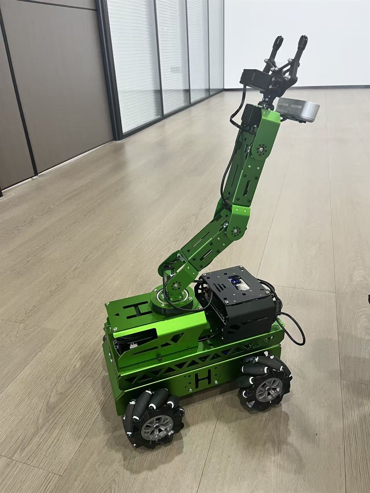
</p>

---

## Why this exists

During my internship at HIKROBOT I watched automated guided vehicles drift off their planned paths on dusty, worn concrete. It was the same drift I had blamed on my own code all season in VEX robotics. I wanted to study it properly, but there was no spare hardware for an intern to experiment on.

So I bought a robot with my own savings: a Hiwonder JetRover with a Mecanum-wheel base, a six-axis arm and ROS 2. Nobody assigned these experiments. Each one exists because the previous one left me with a question I could not answer.

## The route at a glance

| Stage | The question I was asking | What I found |
|---|---|---|
| A. ESP32 bench | How does a PID loop actually behave, before I trust one on real hardware? | No perfect gains, only trade-offs. Integral windup was real and a clamp fixed it. |
| 1–2. Setup and mapping | What is actually inside this robot, and how do I talk to it? | A confirmed hardware map, and one of my own assumptions corrected. |
| 3. Step response vs load | Can I predict how the arm's built-in controller reacts to a heavier load? | **Overshoot grew with load (6.0° → 8.4° → 10.6°), exactly as I predicted from gravity.** |
| 4a. Heating under load | Can heat give me an independent check on the load the servo is carrying? | 400 g heated the shoulder about 2.7× faster than no load. |
| 4b. Maximum acceleration | Does the base joint reach the acceleration I calculated by hand? | **No. It reached about half of it or less, and the arm hit a speed ceiling (most likely in the firmware) that no command could push past.** |
| 5. Heading under a friction disturbance | Can my own controller keep the whole robot straight when one side slips? | **Closed loop cut RMS heading error to about a quarter of the no-correction run on the same surface (one run each).** Then I found where it stops working. |

## How I worked

- **Prediction before measurement.** For every main experiment I wrote down what I expected and why before I ran it. When the result disagreed, the disagreement was the interesting part.
- **Raw data kept.** Every Part B plot comes from the CSV logs in [`data/`](data/), and every number in the result tables was recomputed from those files (the method is in [`data/README.md`](data/README.md)). Nothing is hand-copied. The Part A figures are screenshots of the Arduino Serial Plotter.
- **Honest limits.** Each section ends with what the experiment cannot tell me.
- **Help I used.** I used AI assistants (ChatGPT and Claude) along the way: as a tutor for concepts I had not met yet, and to help write and debug parts of the code, including some of the control and logging code. I ran and tested everything on the hardware myself. Choosing each experiment, the hardware work, the predictions, every measurement and the conclusions are mine.

---

## Part A: Learning the loop on an ESP32

Before trusting a controller on a real robot, I wanted to see a PID loop misbehave somewhere cheap.

### A1. Toolchain and a first blink

Getting an ESP32 to compile and flash took longer than the blink itself. The Arduino toolchain failed with a storage path error until I moved its data and build-cache directories.

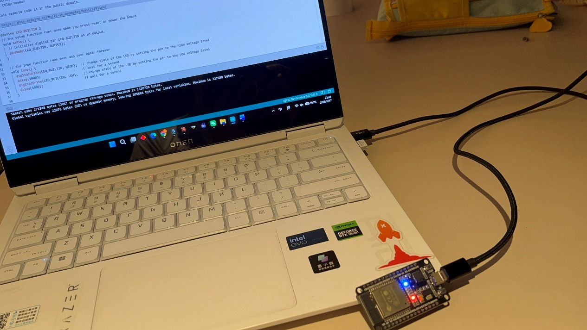

### A2. PID on a simulated plant

I wrote a PID controller from scratch on the ESP32 and pointed it at a **simulated** system, a number that should reach 100. The plant is a model running on the chip, not a real motor. The code is in [`code/esp32/pid_simulated_plant.ino`](code/esp32/pid_simulated_plant.ino).

**Version 1 had no inertia.** The output changed the position directly, so the curve just crept towards the target and carried straight on past it with no sign of turning back. A system with no mass does not behave like anything real.

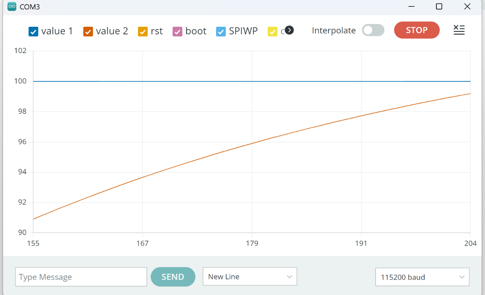

**Version 2 added inertia and damping.** The controller's output now acts like a force: it changes velocity, velocity changes position, and a damping factor lets the system settle. Now the tuning problems became visible:

| Change | What happened | Why |
|---|---|---|
| Ki = 0.02 | Overshot to about 105 and stayed stuck there | **Integral windup.** The integral kept growing while the system was still far from the target, then took forever to unwind. |
| Ki = 0.005 | No overshoot, but stopped at about 101.5 | Too little integral action to remove the last bit of **steady-state error**. |
| Ki = 0.01, timing checked | Better, but still off | I found my loop waited `delay(100)` while the maths assumed `dt = 0.05`. The code was lying to itself about time. |
| Ki = 0.02 **plus an integral clamp** (±50) | Settled to within about 0.3% of the target and kept creeping in | The clamp stops windup, so a useful Ki no longer causes a huge overshoot. |

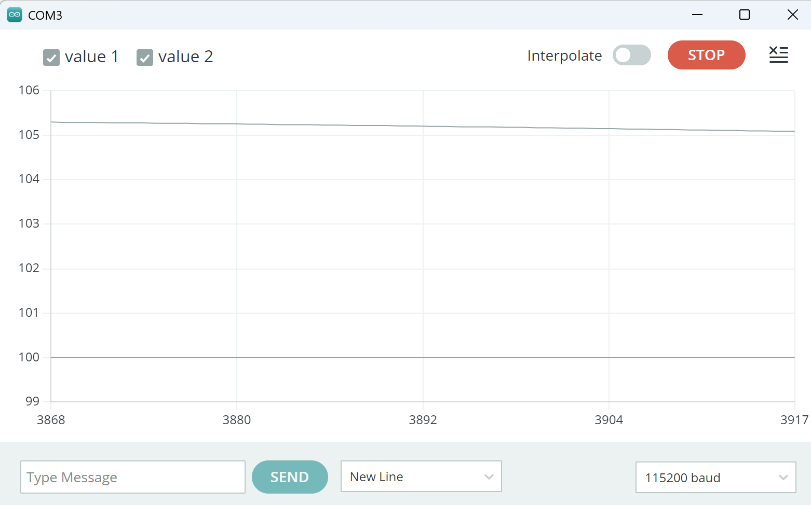
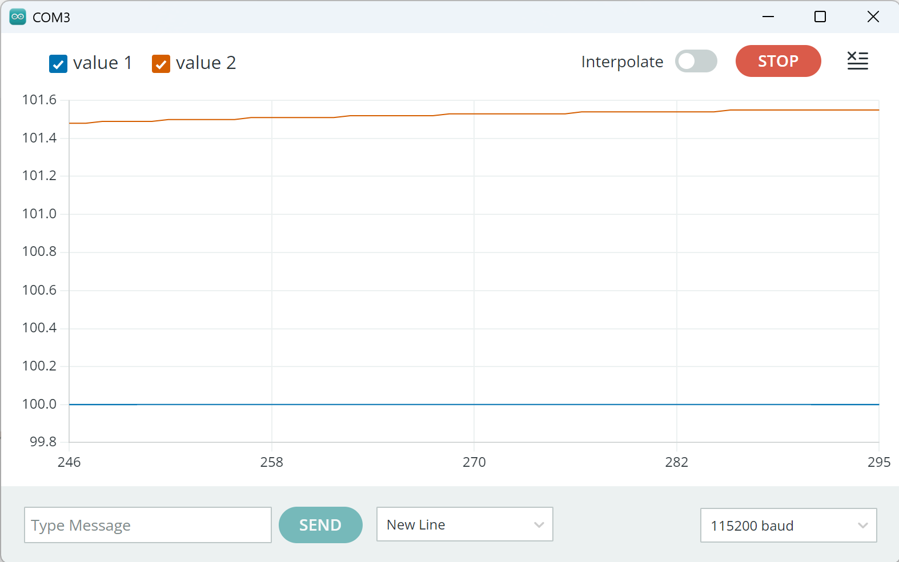
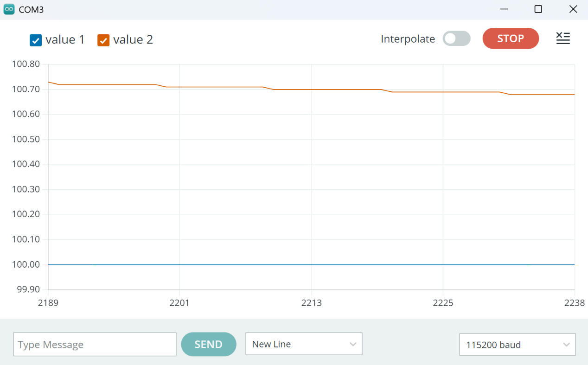

**What I took from it:** there is no perfect set of gains, only trade-offs. More integral kills steady-state error but invites windup. Less integral is calm but never quite arrives.

### A3. Seeing PWM on a logic analyzer

A PID output is useless until it becomes something a motor can feel. On a microcontroller, that is usually PWM: switching a pin on and off fast, with the duty cycle setting the effective power. I generated a 1 kHz signal alternating between 25% and 75% duty ([`code/esp32/pwm_test.ino`](code/esp32/pwm_test.ino)) and captured it on a logic analyzer in PulseView.

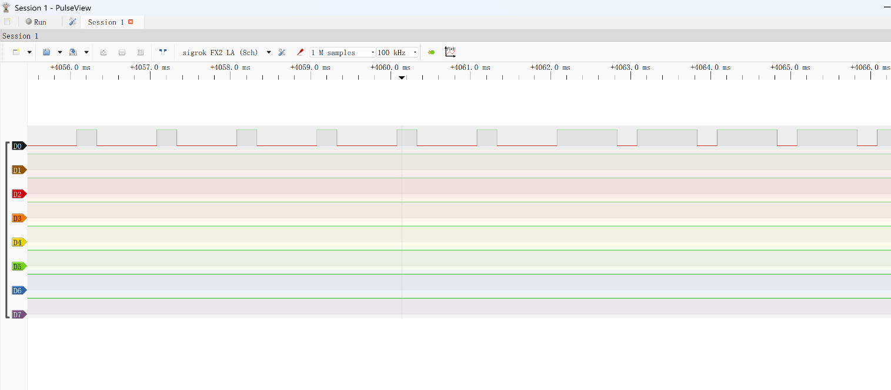

This completed the chain I wanted to understand: **sensor → error → PID → PWM → motor.**

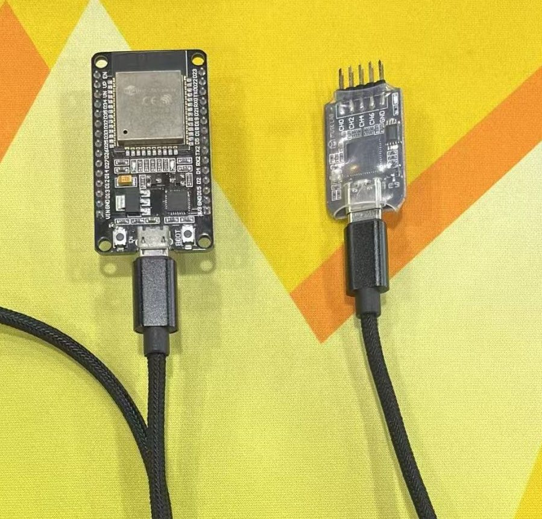

*The ESP32 (left) and the logic analyzer (right).*

---

## Part B: The JetRover

### Stage 1. Environment and remote access

I set up remote access to the robot's onboard computer, built my own ROS 2 workspace and loaded the robot model in RViz so I could see every joint.

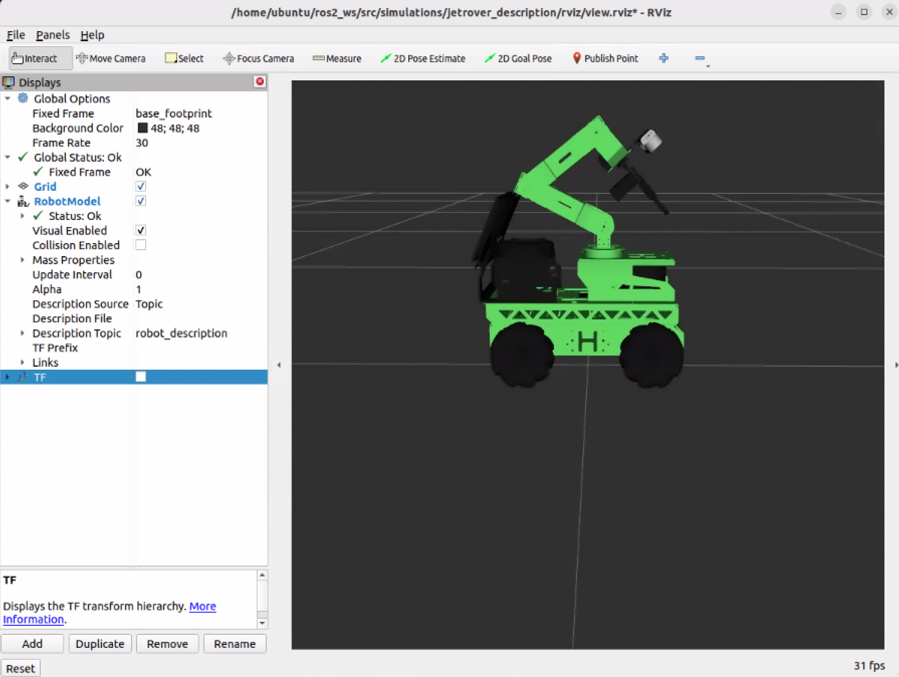

### Stage 2. Mapping the arm

Before measuring anything I needed to know what I was measuring. I queried every bus servo through the robot's ROS 2 service and built a hardware map:

| ID | Joint | Servo | Range (units) |
|---|---|---|---|
| 1 | Base rotation | HTS-20H (20 kg·cm, 58 g) | 0–1000 |
| 2 | Shoulder | HTD-35H (35 kg·cm, 64 g) | 0–1000 |
| 3 | Elbow | HTD-35H (35 kg·cm, 64 g) | 0–1000 |
| 4 | Wrist pitch | HTD-35H (35 kg·cm, 64 g) | 0–1000 |
| 5 | Wrist roll | HX-12H (12 kg·cm, 36.3 g) | 0–1000 |
| 10 | Gripper | HTS-21H (21 kg·cm, 63 g) | **0–700** |

Torque is the manufacturer's stall torque at 11.1 V, and the masses are from the same spec sheet. One servo unit is 0.24°. Two things mattered later. The gripper has a different range, so sending it 1000 would be a mistake. And the wrist pitch is a 35 kg·cm servo, not the 20 kg·cm I had assumed from my notes. My later torque calculations use the corrected table.

The red notes in this figure are mine. They mark which servo drives which joint (from left to right: gripper motor, wrist roll, wrist pitch, elbow, shoulder, and the base servo inside the base), on top of the manufacturer's product diagram and spec table. The product images and specifications belong to Hiwonder.

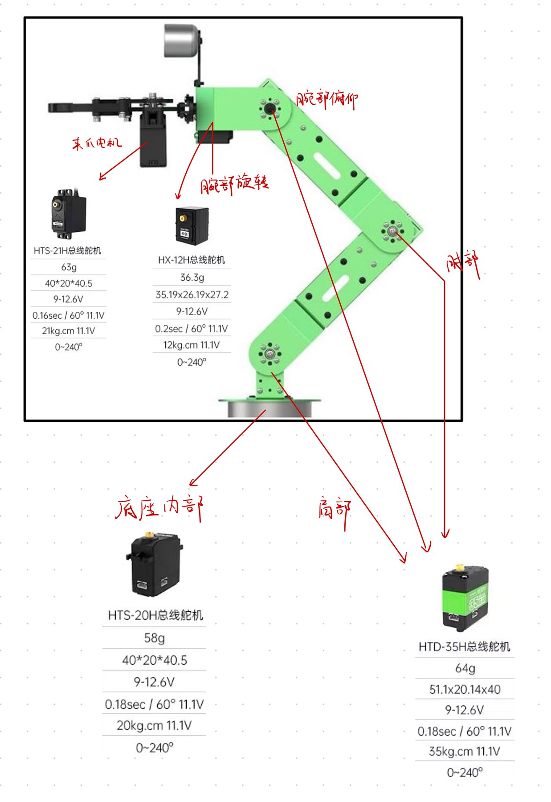

The label on the servo at the shoulder confirms the model and its rating:

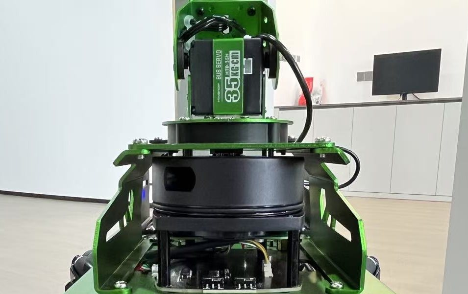

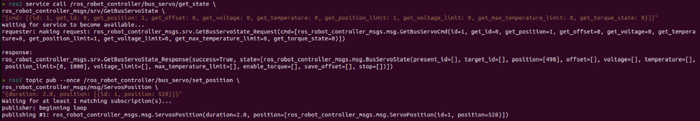

---

### Stage 3. How does the arm's controller react to load?

**Why this experiment.** Each bus servo runs its own position controller inside the firmware. I cannot see or change its gains. What I *can* do is poke it and watch. On the ESP32 I had seen PID effects in a simulation. Here I wanted to see whether I could predict them in a real servo carrying a real load.

**My prediction, written before the runs.** A heavier load should rise more slowly, which is the obvious inertia effect. The less obvious prediction was about **overshoot**. The intuitive guess is that a heavier arm is more sluggish and overshoots less. I expected the opposite. During the move the load passes over the vertical, and at that point gravity flips from resisting the motion to pushing it along. Right when the servo needs to brake, a heavier load is pushing harder, so it should overshoot *more*.

**Method.**
- Shoulder servo (ID 2), a fixed step of −60° (−250 servo units), commanded move time 0.3 s.
- Loads of 0 g, 200 g and 400 g, bound to the wrist section of the arm with black tape, about 20.5 cm from the shoulder axis.
- My own ROS 2 node ([`step_logger.cpp`](code/ros2_stage3_logger/src/step_logger.cpp)) fires the step and logs target and actual angle at 50 Hz for 6 s.

For scale, the load's gravity torque at 20.5 cm is at most about 0.40 N·m for 200 g and 0.80 N·m for 400 g. That is well inside the servo's rating, so any change in behaviour is about control, not strength.

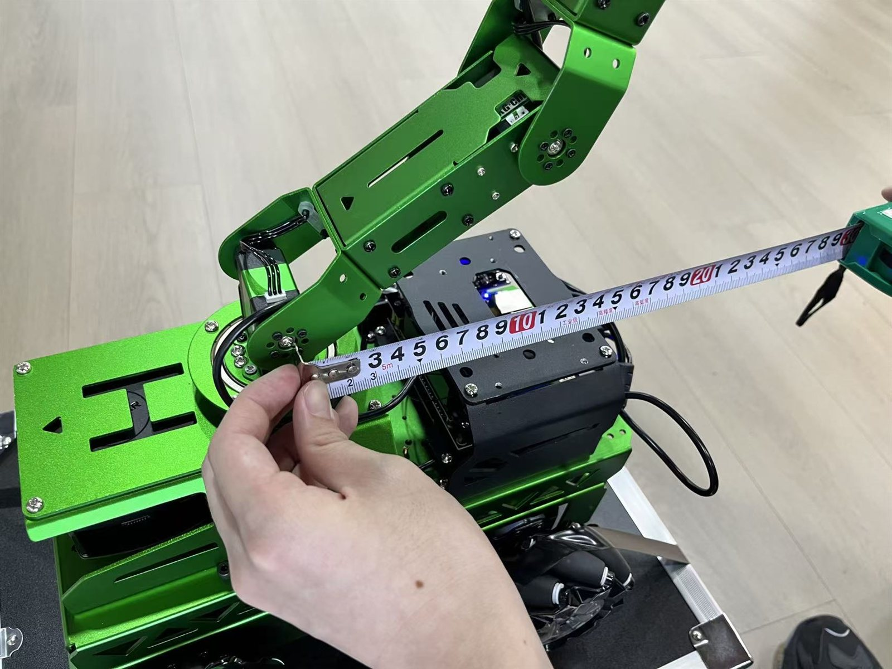

*Measuring along the arm from the shoulder axis with a tape measure.*

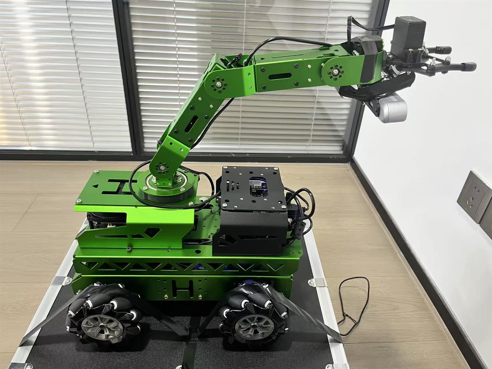

*The test load bound to the wrist section of the arm with black tape.*

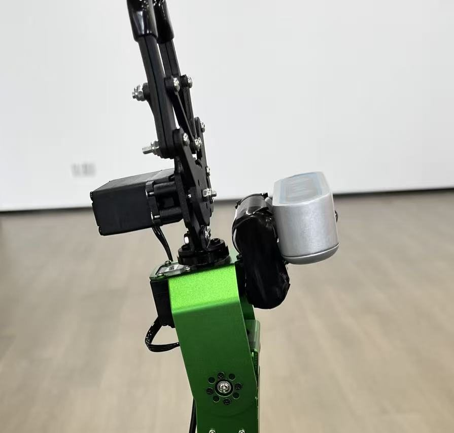

*A closer look at the taped load.*

**Results.**

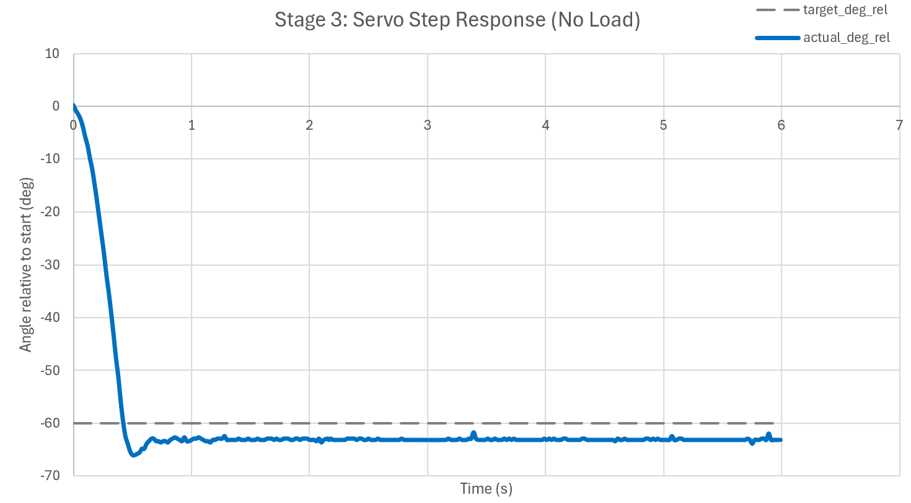
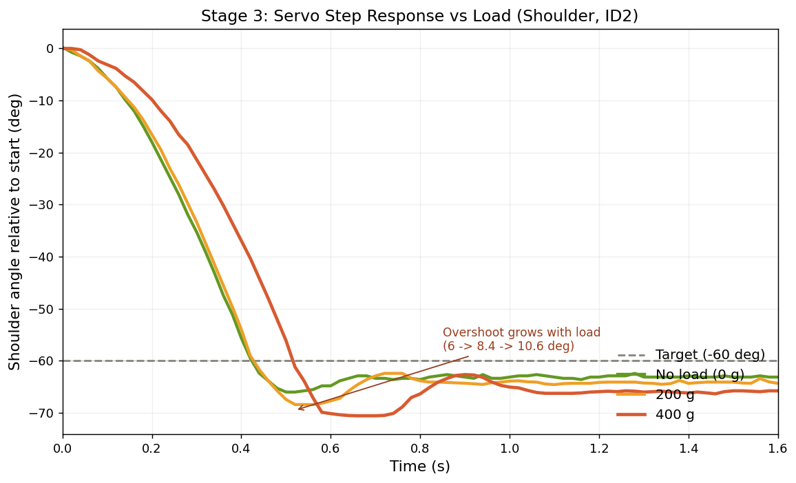

| Load | Rise time (to −54°) | Overshoot past −60° | Final angle (steady-state error) |
|---|---|---|---|
| 0 g | 0.40 s | **6.0°** (to −66.0°) | −63.1° (−3.1°) |
| 200 g | 0.42 s | **8.4°** (to −68.4°) | −64.3° (−4.3°) |
| 400 g | 0.50 s | **10.6°** (to −70.6°) | −65.8° (−5.8°) |

Rise time is the first 20 ms sample past −54°, counted from the moment the step was commanded (the servo itself starts moving about 40 ms later). Overshoot is the largest excursion past −60°. Final angle is the last sample of the 6 s log.

**What I concluded.** All three trends are monotonic and all three have a physical reason:
1. **Rise time grows with load.** More inertia means slower acceleration.
2. **Overshoot grows with load.** This is the counter-intuitive one, and it matched my prediction. Gravity changes sign as the load passes over the vertical, so the heavier load pushes harder at exactly the moment the servo is trying to stop.
3. **Steady-state error grows with load.** At the final pose, gravity keeps pulling the arm down. The servo's internal controller has finite stiffness, so it settles a little past the target, and further for heavier loads.

This was my favourite moment of the project: a behaviour I had first seen as a number on a simulated plant showed up in a real industrial-style servo, and I had predicted it from mechanics before measuring it.

> 🎥 **[Add video link]** 0 g vs 400 g step, ideally in slow motion.

**Limits.** I could not see the servo's internal gains, so I can explain the trends but not model them exactly. I ran each load about three times, but the data folder holds one logged run per load (the one plotted here), so the numbers are single-run values and I have no spread to quote. The rise-time difference between 0 g and 200 g is a single 20 ms sample, so only the 400 g step is clearly slower. The overshoot and steady-state trends are clearer. Adding every repeat to the data folder is on my list.

---

### Stage 4a. Side experiment: does heat agree?

**Why.** Holding a load takes torque, torque takes current, and current makes heat. If that chain holds, heat gives me a second, completely independent way to see the load the servo is carrying.

**Method.** Shoulder servo holding a fixed pose, with 0 g and then 400 g. My node ([`temp_logger.cpp`](code/ros2_stage3_logger/src/temp_logger.cpp)) read its temperature every 10 s. The room was about 31 °C.

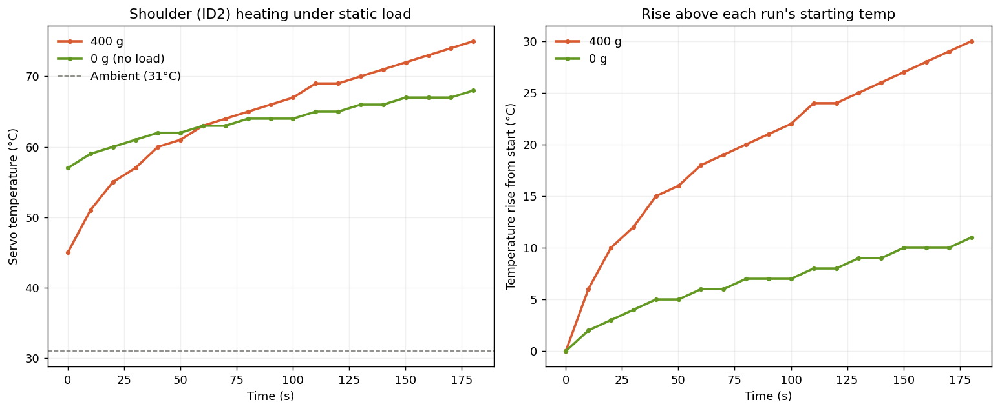

**Result.** Over 180 s, the servo warmed by **30 °C with 400 g** but only **11 °C with no load**, a ratio of about 2.7.

**What I concluded.** More load means more heating, so the chain holds. If heating goes roughly with current squared, and current with torque, the 2.7 ratio should match the squared ratio of the total shoulder torque (arm plus load) in the two cases. Checking that against my torque calculation is on my list.

**Limits, stated honestly.** Neither run reached a plateau; both were still climbing. The no-load run also started warm (57 °C, against 45 °C for the 400 g run) because the servo had not fully cooled. So this is a qualitative trend, not a precise measurement. It is also why I made the next experiment my main one: it measures the load's effect through motion, which is cleaner than waiting for heat.

---

### Stage 4b. Main experiment: can the base reach the acceleration I calculated?

**Why.** If I know the arm's moment of inertia and the motor's torque, I should be able to predict its maximum angular acceleration. I wanted to know whether a spec sheet and some mechanics are enough to predict a real machine.

**My prediction, calculated by hand.** With the arm stretched out horizontally, rotating about the vertical base axis (ID 1), I modelled every part. Compact parts (motors, gripper) were treated as point masses, I = m·d². Long links (upper arm, forearm) were treated as rods using the parallel-axis theorem, I = (1/12)·m·L² + m·d².

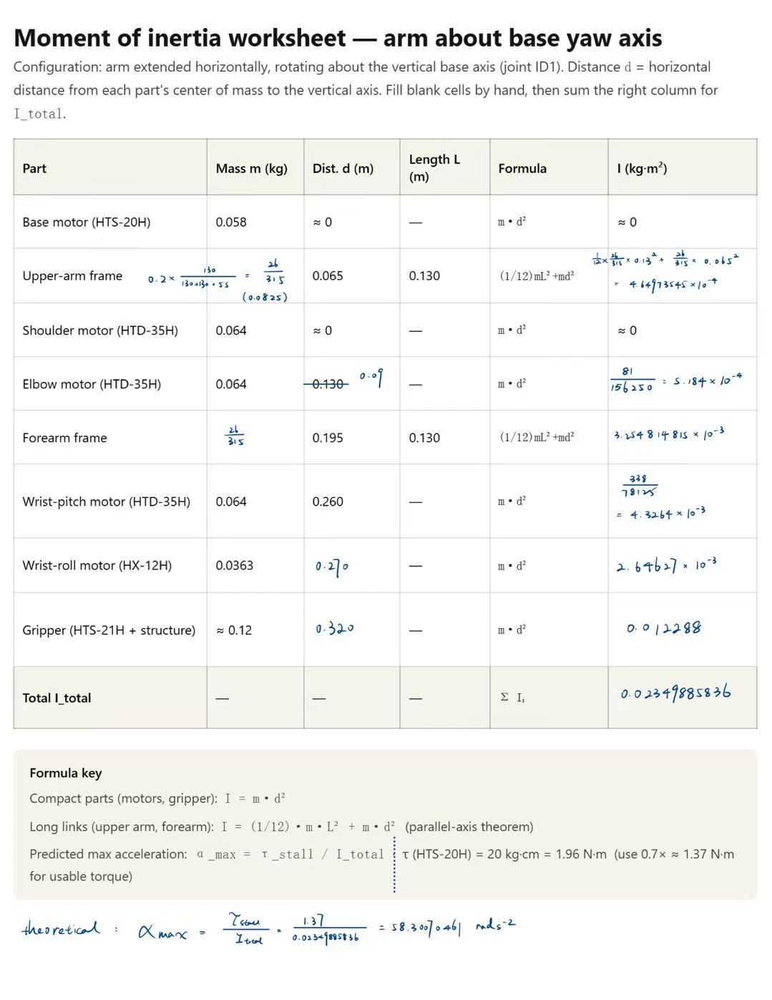

<details>
<summary>Earlier working notes behind the worksheet (link lengths, masses and distances)</summary>

The parameter checklist I worked through first. The ticks mark the items I had settled, and the handwritten lengths (168, 55, 130 and 130 mm, 428 mm in total) are the link lengths I used.

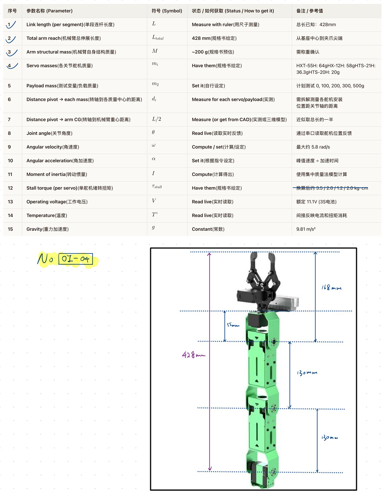

A first draft of each part's mass and its distance from the joint it loads. The question marks are masses I did not know yet. The final worksheet above measures every distance from the base axis instead.

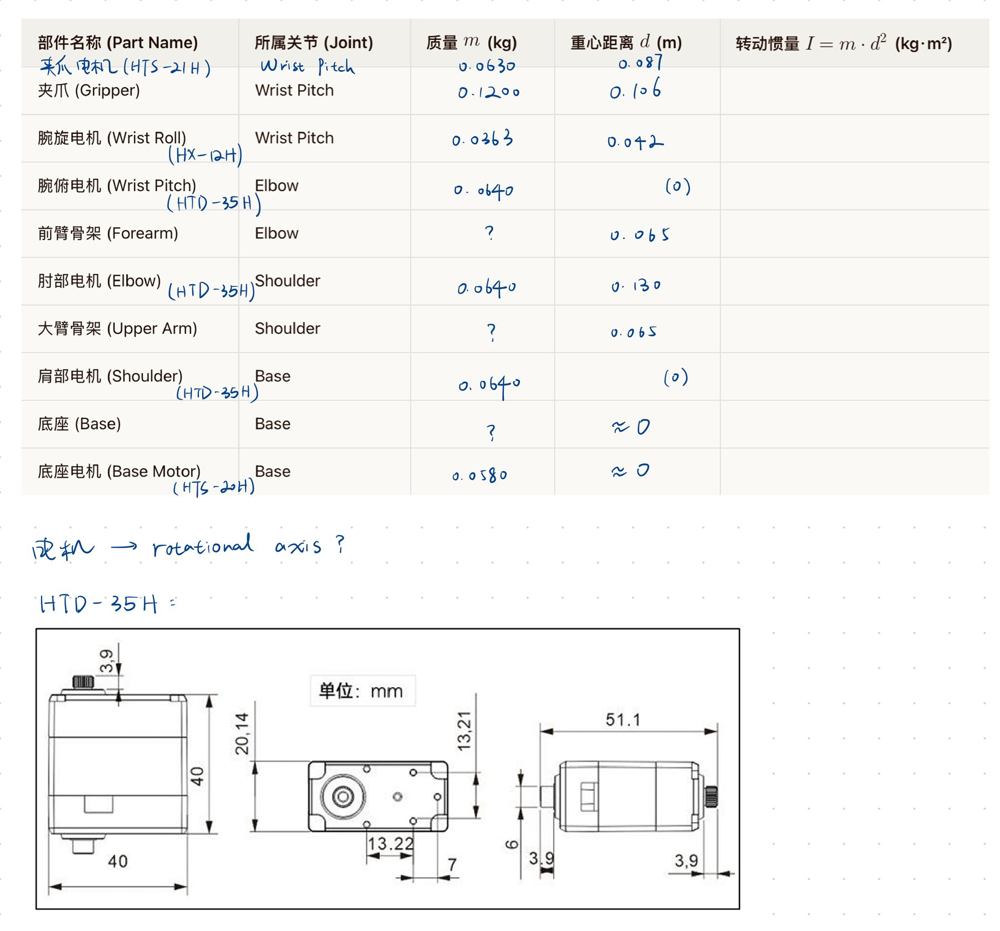

</details>

- Total: **I ≈ 0.0235 kg·m²**
- Base servo stall torque: 20 kg·cm = 1.96 N·m. I used 70% of that, 1.37 N·m, as the usable figure.
- **Prediction: α_max = τ / I ≈ 1.37 / 0.0235 ≈ 58 rad/s².** Using the full stall torque instead gives about 83 rad/s².

**Method.** I commanded the base to turn from its starting position (servo position about 502) to position 1250, which is +180°. That target is beyond the end of the servo's 0–1000 range, so every run ends when the arm reaches the end of its range, after about 120° of travel. I kept shortening the commanded move time, from 0.5 s down to 0.05 s (five runs: 0.5, 0.3, 0.2, 0.15 and 0.05 s), which demands a steeper and steeper acceleration. The idea was that once I demand more than α_max, the real motion can no longer keep up, and the point where it falls behind tells me the true limit.

**Result.**

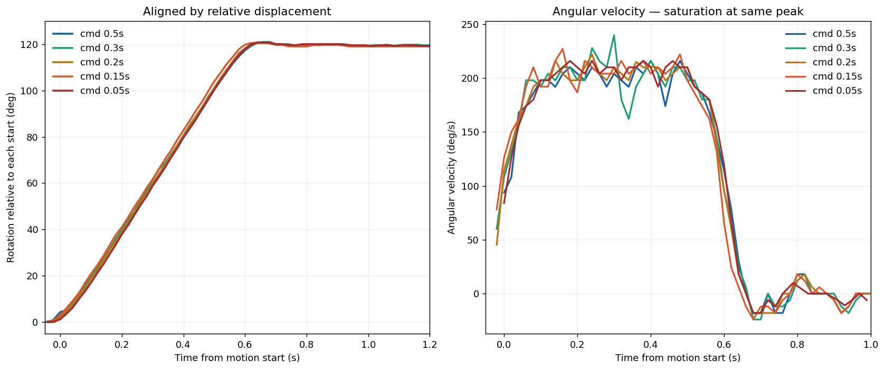

The curves for all five commanded times lie almost exactly on top of each other. From 0.3 s to 0.05 s the commanded move is six times faster, which is **36 times the acceleration** if the servo plans a constant-acceleration move (its real profile is internal to the servo, so treat 36× as the size of my demand, not a measurement). The arm moved identically every time, taking about 0.6 s for about 120°. The angular velocity plot shows why: every run climbs to the **same ceiling, about 205–210 °/s on average along the plateau (≈ 3.6 rad/s; single samples reach 220–230 °/s)**, holds it for about 0.4 s, then stops when it reaches the end of the servo's range.

The measured acceleration is **roughly 20–30 rad/s²**, depending on the method. The plateau speed (≈ 3.6 rad/s) divided by the 0.12–0.18 s the arm takes to reach it gives about 20–30, and a noisy second-difference of the angle data gave 21–31. **Against my prediction of 58 rad/s² that is about half, or somewhat less.** At the low end it is a third of the prediction and at the high end just over half, so I only claim "about half or less".

**What I concluded.** My arithmetic was right (I rechecked every row of the worksheet), but a model built from spec-sheet numbers did not describe how the servo actually moved. In order of how strongly the data supports each cause:
1. **A speed ceiling is the main limit.** Five runs asking for very different accelerations all hit the same speed, about 3.6 rad/s. That is roughly two-thirds of the spec sheet's no-load speed for this servo (0.18 s per 60°, about 5.8 rad/s). Even my slowest command (about 120° in 0.5 s) asked for more than the ceiling, so I never saw the arm following a command it could easily keep up with. The most likely source is a speed limit in the servo firmware, but I have not ruled out the motor's loaded speed (a motor slows down as torque rises) or the supply voltage. A run where the ceiling moves, with a different load or voltage, would tell these apart.
2. **Stall torque is not the torque you get while moving.** Stall torque is measured with the motor held still. As it speeds up, the available torque falls. This probably explains part of the gap but I cannot size it from my data.
3. **Friction and gearbox losses** take a further share.

The lesson I keep coming back to: **a spec-sheet number describes one specific situation, and it is easy to use it in a situation it does not describe.** It is the same lesson I met on the wall-climbing robots I tested at TRI. A maximum rating is something a machine can *reach*, not something it can be held at, and designing as if it could be held there is exactly where problems start.

**Limits.**
- **The worksheet.** The servo masses and the 200 g arm structure come from the manufacturer's spec sheet. The gripper mass (about 0.12 kg including its structure) and the centre-of-mass distances are my estimates, since I did not weigh or dismantle the parts. Cables, fasteners and the camera on the wrist are not in the worksheet. Extra mass would raise the inertia and lower the predicted acceleration a little, so my prediction is probably slightly high. The wrist-roll (HX-12H, 36.3 g) and gripper (HTS-21H) labels in the worksheet match the spec sheet; it was the first draft of my Stage 2 table that had them the wrong way round, and that is now fixed.
- **The 0.5 s run.** Its log starts 0.8 s late and its angle reference is about 121° off from the others, so I aligned every run by displacement from its own start in the plot. The arm itself went from position 503 to about 1000 like the other four and reaches the same speed ceiling, so it counts as a fifth run.
- **No unsaturated reference run.** Every command I sent was faster than the ceiling, so I measured the ceiling and the ramp up to it, not a clean torque-limited acceleration.
- **The acceleration figure is the weakest number in this repo.** The servo reports position at about 50 Hz, so the ramp has only about six samples, and the true peak acceleration could be higher than my range. Re-deriving it from the raw CSV with a proper fit is on my list. The main conclusion does not depend on it: whatever the exact figure, the arm ran into a speed ceiling, not into my inertia estimate.

> 🎥 **[Add video link]** 0.3 s and 0.05 s commands side by side, looking identical.

---

### Stage 5. Keeping the whole robot straight when one side slips

**Why.** This is the question that started everything: the drift I saw at HIKROBOT. Can I make the whole vehicle hold a straight line when one side has less grip?

**What I found first.** The chassis does not expose raw wheel-encoder counts, only the speeds it has been told to produce. So a per-wheel closed loop was impossible from my level, and from my side the wheels are effectively open-loop. What the robot *does* publish is `/odom`, a pose estimate from an EKF that fuses wheel odometry with the onboard IMU. I tested that it was real by turning the robot by hand and watching both the odometry and the IMU heading follow the actual rotation.

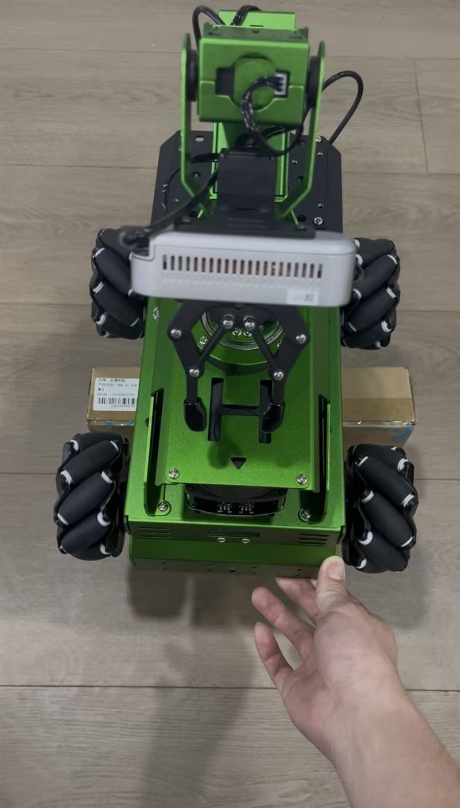

*Turning the robot by hand (a frame from a video) while watching the heading in the terminal.*

So I built what the sensing allowed: **an outer heading loop around the chassis's own speed control.** My node ([`heading_pid.cpp`](code/ros2_stage3_logger/src/heading_pid.cpp)) locks the starting heading as its target, drives forward, and corrects with a turning command. It uses Kp = 1.5, Kd = 0.2 and Ki = 0, running at 50 Hz. Setting Kp to 0 gives the baseline with no heading correction. I call those runs "open loop", but strictly the derivative gain stayed at 0.2. Refitting the logged commands gives Kp = 0.00, Kd = 0.20 for the two baseline runs and Kp = 1.50, Kd = 0.20 for the closed-loop run, so the controller ran exactly as described. The derivative term reacts to how fast the heading is changing, not to how far it has drifted, so it cannot hold a heading, but it is not zero either. The baselines are "no correction", not strictly "no feedback".

**My prediction.** On a normal floor the robot should drive almost straight on its own. With a low-friction strip under one side, that side slips, the robot does not know, and it drifts. My controller should pull the heading back.

**Method.** Forward at 0.1 m/s for 10 s (about 1 m), three conditions: open loop on normal floor, open loop with paper under one side, and closed loop with paper under one side. I first tested the controller with the wheels off the ground. The log of that test ([`data/stage5/heading_test.csv`](data/stage5/heading_test.csv)) shows the commanded turn rate following 1.5 times the heading error, as it should.

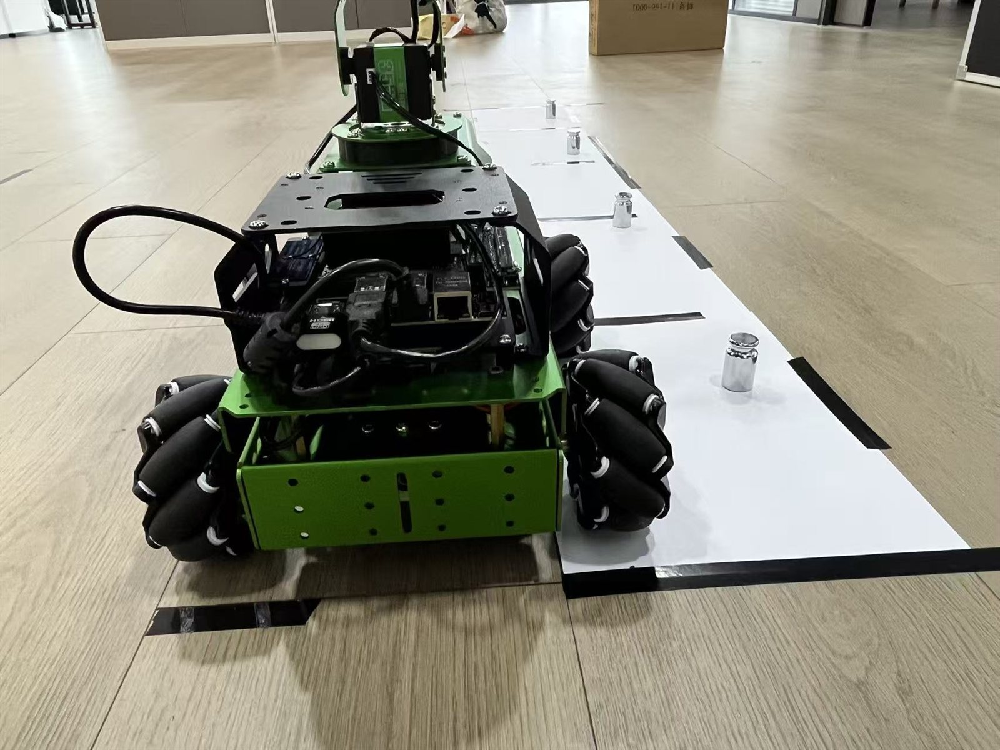

*The right-hand wheels on the paper strip, with small metal weights on the paper. Most of the photos in this repo were taken at a technology testing office where I had more open floor; see [`media/README.md`](media/README.md).*

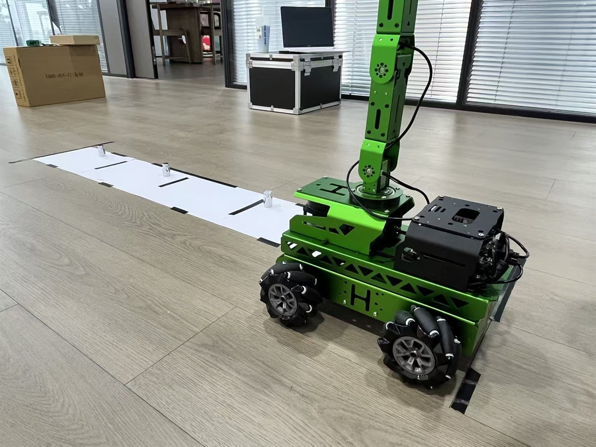

*The strip seen from the side, with black tape marks along it.*

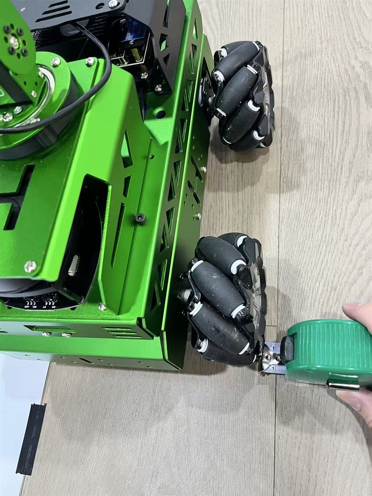

*Measuring sideways displacement with a tape measure.*

> 🎥 **[Add video link]** Wheels-off-the-ground test, then the three straight-line runs.

**Results.**

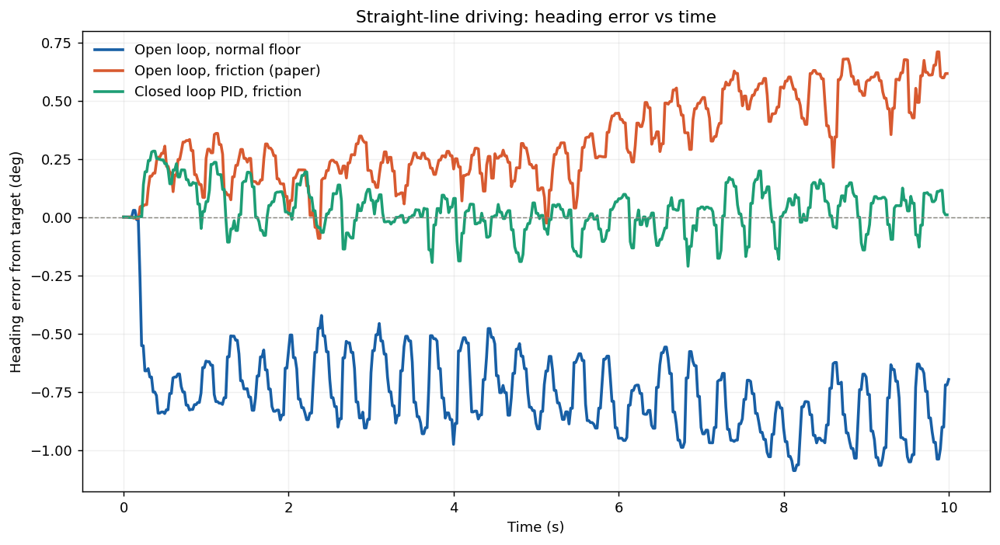

| Condition | Final heading error (mean of last 0.5 s) | Max error | RMS error |
|---|---|---|---|
| Open loop, normal floor | −0.85° | 1.09° | 0.78° |
| Open loop, paper under one side | +0.59° | 0.71° | 0.37° |
| **Closed loop, paper under one side** | **+0.04°** | **0.28°** | **0.10°** |

With the same disturbance, closed loop cut the RMS heading error from 0.37° to 0.10°, **about a quarter**. Against the open-loop floor run it is about an eighth, and the final error is almost zero. The green line stays pinned near zero while the other two wander away.

One caution about these numbers. The two baseline runs differ by more than a factor of two (RMS 0.78° on the bare floor, 0.37° with paper), and in the wrong direction for a friction disturbance. So run-to-run variation is already as large as the effect I added, and with one run per condition I cannot separate the controller's effect from that variation. The closed-loop run is four times better than the better baseline, which is encouraging, but it needs several repeats of each condition before I would call it a result.

**Then the part that did not fit.** I also measured how far sideways each run ended up, with a tape measure: about 2 cm (open loop, floor), 1.1 cm (open loop, paper) and 0.3–0.5 cm (closed loop, paper). The paper run should have drifted *more* than the bare floor, but it drifted less. The reason is that the disturbance I introduced was about the same size as the floor itself: dust, grit, the seams between floorboards, any slight slope, and the small jolt at start-up all move the robot by a centimetre or two. My signal was buried in the noise of my own bedroom floor. So I trust the heading data, which was logged continuously, and not the tape-measure numbers.

**The boundary I found.** A heading loop controls which way the robot *faces*, not where it *is*. A Mecanum robot can keep a perfect heading and still slide sideways, and my controller cannot see that slide at all. Closing that gap needs a position measurement that does not come from the wheels, most likely a camera.

---

## What I found, in one place

- **Prediction beats hindsight.** The overshoot result in Stage 3 was only convincing because I wrote the gravity argument down before the data existed.
- **A spec number describes a situation, not a machine.** Stall torque describes a motor held still. Rated power describes a motor turning at rated speed. Most of my wrong predictions came from using a number outside the situation it describes.
- **The real limit may be hidden where you cannot see it.** The base joint was not limited by my inertia estimate but by a speed ceiling, most likely in the firmware, that I only noticed when five curves hit the same value.
- **Feedback only fixes what it can measure.** My heading loop reduced heading error in my runs and was blind to sideways slide.
- **A test is only as good as its signal-to-noise ratio.** My friction disturbance was about the size of the floor's own noise, so the tape-measure result could not tell the conditions apart.

## What's next

1. **Make the disturbance bigger than the noise.** Replace the paper with a much slicker plastic sheet so the drift reaches around 10 cm, well above the floor's noise.
2. **Close the position loop with a camera.** Use visual feedback, for example the robot's line-following or marker detection, to control sideways position as well as heading.
3. **Re-derive the base acceleration** from the raw angle data with a proper fit, and repeat each saturation run several times. Add slower commands (1 s, 2 s) that the arm can follow, and a run with a different load or supply voltage, to see whether the ceiling moves.
4. **Check the heat against torque.** Compare the 2.7 heating ratio with the squared ratio of my calculated shoulder torques.
5. **Repeat Stage 3 at more loads** to see whether overshoot grows linearly with load torque.
6. **Repeat the Stage 5 runs** at least five times per condition, and rerun the baseline with Kd = 0 as well as Kp = 0.

## Repository map

```
jetrover-control-experiments/
├── README.md                  ← this file
├── figures/                   ← every figure used above, including the worksheet scans
├── code/
│   ├── esp32/                 ← PID on a simulated plant, PWM test
│   └── ros2_stage3_logger/    ← ROS 2 package `stage3_logger`: step_logger, temp_logger, heading_pid
├── data/                      ← raw CSV logs (see data/README.md)
└── media/                     ← photos (media/photos/) and video links (see media/README.md)
```

**Platform:** Hiwonder JetRover (Mecanum base, six-axis bus-servo arm), ROS 2 · ESP32 Dev Module (Arduino IDE 2.3.10) · sigrok FX2 logic analyzer with PulseView.
